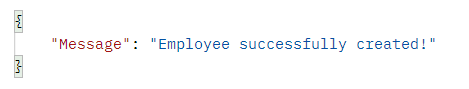

# EPAM_PROJECT

**This documentation describes and shows how to use the application correctly.
To get started, first read "README.md" and follow the instructions there.**

 Documentation use flask development server 

#Employer
There will be described ***employer*** API endpoints.
    

***GET Methods***

>1.1 **http://127.0.0.1:5000/api/get_all_employers**
         
    Parameters: this endpoint does not take additional parameters
    Response: Returns a JSON object with a list of all employers in the system.

>1.1 **Example Response**
HTTP/1.1 200 OK
Content-Type: application/json

>1.2 **http://127.0.0.1:5000/api/get_employer_by_email/<EMPLOYER_EMAIL_ADDRESS>**
         
    Parameters: this endpoint takes only one parameter, employer you want to retrieve email address
    Response: Returns a JSON object with a data of a certain employer.

>1.2 **Example Response**
HTTP/1.1 200 OK
Content-Type: application/json

 
>1.3 **http://127.0.0.1:5000/api/get_employer_by_date_of_birth/<EMPLOYER_DATE_OF_BIRTH>**
         
    Parameters: this endpoint takes only one parameter, employer you want to retrieve birth date
    Response: Returns a JSON object with a data of a certain employer.

>1.3 **Example Response**
HTTP/1.1 200 OK
Content-Type: application/json

***POST Methods***
>2.1 **http://127.0.0.1:5000/api/add_employer?name=<EMPLOYER_NAME>&lastname=<EMPLOYER_LASTNAME>&email=<EMPLOYER_EMAIL_ADDRESS>&date_of_birth=<EMPLOYER_DATE_OF_BIRTH>**
         
    Parameters: this endpoint takes 4 parameters, name, lastname, email address, date of birth.
    Validation:
        1. Name length not less than 2 and not more than 30 letters. Only letters are allowed.
        2. Lastname length not less than 2 and not more than 30 letters. Only letters are allowed.
        3. Email address maximum length equals to 254, correct email format(email@email.com etc.)
        4. Date of birth format YYYY-MM-DD
    Response: "Message": "Employer successfully created!".

>2.1 **Example Response**
HTTP/1.1 200 OK
Content-Type: application/json

***PUT Methods***
>3.1 **http://127.0.0.1:5000/api/update_employer/<EMPLOYER_YOU_WANT_TO_UPDATE_EMAIL_ADDRESS>**
         
    Parameters: this endpoint takes 3 parameters, name, lastname, email address. The parameters should be set in the body in json format

    Validation:
        1. Name length not less than 2 and not more than 30 letters. Only letters are allowed.
        2. Lastname length not less than 2 and not more than 30 letters. Only letters are allowed.
        3. Email address maximum length equals to 254, correct email format(email@email.com etc.)
    Response: Returns a JSON object with a data of a updated employer.

>3.1 **Example Response**
HTTP/1.1 200 OK
Content-Type: application/json

***DELETE Methods***
>4.1 **http://127.0.0.1:5000/api/delete_employer/<EMPLOYER_YOU_WANT_TO_DELETE_EMAIL_ADDRESS>**
         
    Parameters: this endpoint takes 1 parameter email address.
    Response: "Message": "Employer has been succesfully deleted!".

>4.1 **Example Response**
HTTP/1.1 200 OK
Content-Type: application/json

#Employee
There will be described ***employee*** API endpoints.
    

***GET Methods***

>1.1 **http://127.0.0.1:5000/get_all_employees**
         
    Parameters: this endpoint does not take additional parameters
    Response: Returns a JSON object with a list of all employees in the system.

>1.1 **Example Response**
HTTP/1.1 200 OK
Content-Type: application/json

>1.2 **http://127.0.0.1:5000/api/get_employee_by_email/<EMPLOYEE_EMAIL_ADDRESS>**
         
    Parameters: this endpoint takes only one parameter, employee you want to retrieve email address.
    Response: Returns a JSON object with a data of a certain employee.

>1.2 **Example Response**
HTTP/1.1 200 OK
Content-Type: application/json

 
>1.3 **http://127.0.0.1:5000/api/get_employee_by_date_of_birth/<EMPLOYEE_DATE_OF_BIRTH>**
         
    Parameters: this endpoint takes only one parameter, employee you want to retrieve birth date.
    Response: Returns a JSON object with a data of a certain employee or employees.

>1.3 **Example Response**
HTTP/1.1 200 OK
Content-Type: application/json

>1.4 **http://127.0.0.1:5000/api/get_employees_by_employer_id/<EMPLOYER_ID>**
         
    Parameters: this endpoint takes only one parameter, employer id for employee you want to retrieve.
    Response: Returns a JSON object with a data of a certain employee or employees.

>1.4 **Example Response**
HTTP/1.1 200 OK
Content-Type: application/json

***POST Methods***
>2.1 **http://127.0.0.1:5000/api/add_employee?name=<EMPLOYEE_NAME>&lastname=<EMPLOYEE_LASTNAME>&email=<EMPLOYEE_EMAIL_ADDRESS>&date_of_birth=<EMPLOYEE_DATE_OF_BIRTH&employer_id=<EMPLOYER_ID>**
         
    Parameters: this endpoint takes 4 parameters, name, lastname, email address, date of birth.
    Validation:
        1. Name length not less than 2 and not more than 30 letters. Only letters are allowed.
        2. Lastname length not less than 2 and not more than 30 letters. Only letters are allowed.
        3. Email address maximum length equals to 254, correct email format(email@email.com etc.)
        4. Date of birth format YYYY-MM-DD
        5. Employer id should be id of existing emloyer
    Response: "Message": "Employee successfully created!".

>2.1 **Example Response**
HTTP/1.1 200 OK
Content-Type: application/json

***PUT Methods***
>3.1 **http://127.0.0.1:5000/api/update_employee/<EMPLOYEE_YOU_WANT_TO_UPDATE_EMAIL_ADDRESS>**
         
    Parameters: this endpoint takes 3 parameters, name, lastname, email address. The parameters should be set in the body in json format

    Validation:
        1. Name length not less than 2 and not more than 30 letters. Only letters are allowed.
        2. Lastname length not less than 2 and not more than 30 letters. Only letters are allowed.
        3. Email address maximum length equals to 254, correct email format(email@email.com etc.)
        4. Employer id should be id of existing emloyer
    Response: Returns a JSON object with a data of a updated employer.

>3.1 **Example Response**
HTTP/1.1 200 OK
Content-Type: application/json

***DELETE Methods***
>4.1 **http://127.0.0.1:5000/api/delete_employee/<EMPLOYEE_YOU_WANT_TO_DELETE_EMAIL_ADDRESS>**
         
    Parameters: this endpoint takes 1 parameter email address.
    Response: "Message": "Employee has been succesfully deleted!".

>4.1 **Example Response**
HTTP/1.1 200 OK
Content-Type: application/json

###WEBSERVICE
**Webservice urls are like APIs urls, to use them just delete api from API url. for example:**
>To get all employers you use "http://127.0.0.1:5000/api/get_all_employers". To do the same with webservice use "http://127.0.0.1:5000/get_all_employers".
